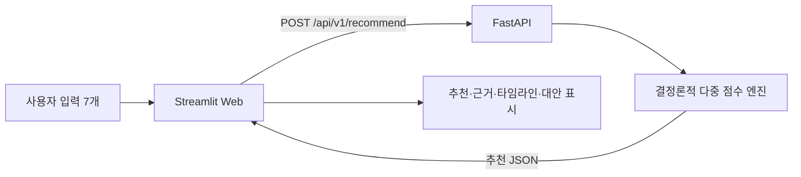

# FlowPilot

**지금의 시간·에너지·환경에 맞는 몰입 루틴을 설계하는 상황 기반 추천 서비스**

[](https://github.com/ahnharam/flowpilot-recommender/actions/workflows/ci.yml)


FlowPilot은 목표, 가용 시간, 현재 에너지, 작업 환경, 작업 유형, 방해 수준, 선호 리듬을 함께 분석합니다. FastAPI가 8개 몰입 루틴을 7개 관점으로 점수화하고, Streamlit은 최상위 추천과 대안·선정 근거·분 단위 실행 계획을 시각화합니다.

> 이 프로젝트는 오픈소스소프트웨어실습 기말 대체 과제로 제작했습니다. 추천 계산은 프론트엔드가 아닌 FastAPI에서만 수행합니다.

## 핵심 흐름



- Streamlit과 FastAPI는 서로 다른 비-root 컨테이너로 분리했습니다.
- 컨테이너 간 통신은 Docker 내부 네트워크의 `http://api:8000`을 사용합니다.
- EC2 외부에는 Streamlit 포트만 공개하고 FastAPI 진단 포트는 `127.0.0.1`에만 바인딩합니다.
- 같은 입력은 항상 같은 추천·점수·타임라인을 반환해 재현 가능한 데모와 테스트를 보장합니다.

## 차별화된 추천 설계

추천 후보는 `딥 포커스 플라이트`, `포모도로 코어`, `마이크로 런치`, `노이즈 실드`, `크리에이티브 웨이브`, `어드민 배치`, `리커버리 램프`, `커뮤트 캡슐`의 8개입니다.

각 후보를 다음 7개 항목으로 독립 평가한 뒤 총점으로 순위를 정합니다.

1. 작업 유형 적합도
2. 가용 시간 적합도
3. 에너지 적합도
4. 환경 적합도
5. 방해 수준 적합도
6. 선호 리듬 적합도
7. 목표 키워드 적합도

최종 응답에는 추천 1개와 대안 2개, 설명 가능한 점수 분해, 각 루틴의 권장 상한 안에서 시간을 배분한 타임라인, 실행 팁이 포함됩니다.

## 빠른 실행

### Docker Compose

```bash
git clone https://github.com/ahnharam/flowpilot-recommender.git
cd flowpilot-recommender
cp .env.example .env
docker compose up --build -d
docker compose ps
```

- Streamlit: <http://localhost:8502>
- FastAPI health: <http://localhost:8001/health>
- FastAPI docs: <http://localhost:8001/docs>

중지할 때는 다음 명령을 사용합니다.

```bash
docker compose down
```

### 개발 모드

백엔드:

```bash
cd back
python -m venv .venv
# Windows: .venv\Scripts\activate
source .venv/bin/activate
pip install -r requirements-dev.txt
uvicorn app.main:app --reload
```

프론트엔드:

```bash
cd front
python -m venv .venv
# Windows: .venv\Scripts\activate
source .venv/bin/activate
pip install -r requirements.txt
API_URL=http://127.0.0.1:8000 streamlit run app.py
```

PowerShell에서는 환경 변수를 먼저 설정합니다.

```powershell
$env:API_URL = "http://127.0.0.1:8000"
streamlit run app.py
```

## API 예시

```bash
curl -X POST http://127.0.0.1:8001/api/v1/recommend \
  -H 'Content-Type: application/json' \
  -d '{
    "goal": "기말 프로젝트 README와 배포 검증 마무리",
    "available_minutes": 75,
    "energy_level": 4,
    "environment": "cafe",
    "task_type": "coding",
    "interruption_level": "medium",
    "preferred_style": "structured"
  }'
```

응답의 주요 필드는 다음과 같습니다.

```json
{
  "request_id": "fp-...",
  "algorithm_version": "1.0",
  "recommendation": {
    "title": "...",
    "score": 91.4,
    "why_it_fits": ["..."],
    "timeline": [{"start_minute": 0, "end_minute": 8, "action": "..."}],
    "tips": ["..."],
    "score_breakdown": {"task_fit": 100, "total": 91.4}
  },
  "alternatives": [{"title": "..."}, {"title": "..."}],
  "rationale": "..."
}
```

## 검증

```bash
cd back
pip install -r requirements-dev.txt
pytest

cd ..
docker compose config
docker compose up --build -d
bash scripts/verify_deployment.sh
```

GitHub Actions는 백엔드 테스트, 프론트엔드 문법 검사, Compose 구성 검사, 두 Docker 이미지 빌드를 자동 수행합니다.

## AWS EC2 배포

Amazon Linux 2023에서 Docker와 Compose가 준비된 뒤 다음을 실행합니다.

```bash
git clone https://github.com/ahnharam/flowpilot-recommender.git
cd flowpilot-recommender
bash scripts/deploy_ec2.sh
```

보안 그룹에는 Streamlit용 TCP `8502`만 필요한 소스 범위에 공개합니다. API의 호스트 포트 `8001`은 Compose에서 loopback 전용이므로 외부에 노출되지 않습니다.

## 프로젝트 구조

```text
flowpilot-recommender/
├─ front/                  # Streamlit 프론트엔드
├─ back/                   # FastAPI API, 추천 엔진, 테스트
├─ docs/                   # 요구사항 추적표와 데모 시나리오
├─ scripts/                # EC2 배포·검증 자동화
├─ .github/workflows/      # CI
├─ docker-compose.yml
└─ .env.example
```

## 문서

- [과제 요구사항 추적표](docs/ASSIGNMENT_TRACEABILITY.md)
- [데모 촬영 시나리오](docs/DEMO_SCRIPT.md)

## License

[MIT](LICENSE)
